# Architecture Diagrams & Visual References

This document contains visual representations of the system architecture using Mermaid diagrams, which can be rendered in GitHub, GitLab, and other markdown viewers.

---

## 1. System Component Flow

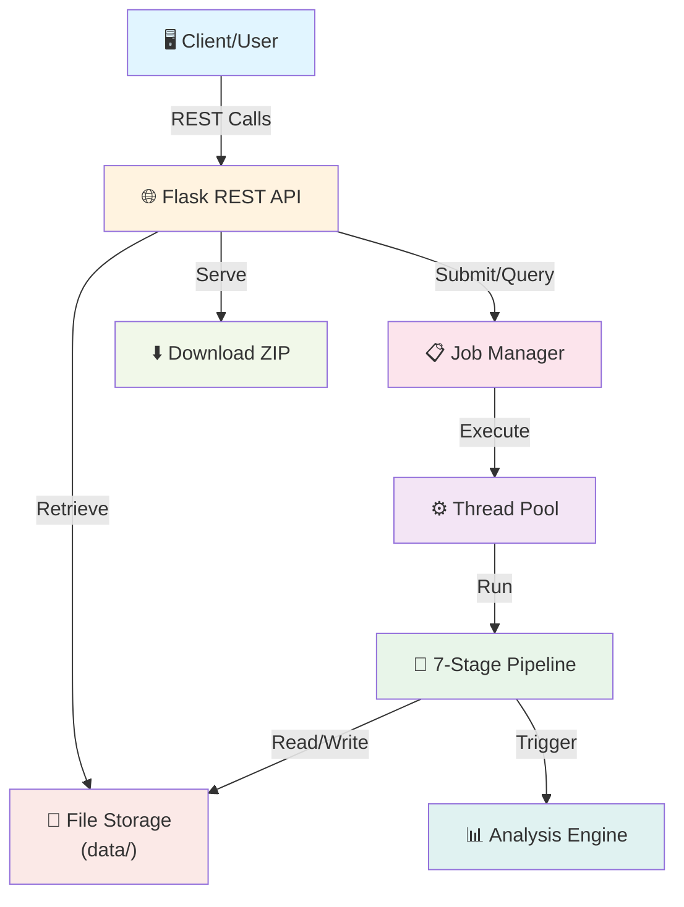

---

## 2. Complete MD Pipeline Stages

```mermaid
graph LR
    Input["📁 Input:<br/>protein.pdb<br/>ligand.pdb"]
    
    S1["<b>Stage 1</b><br/>Protein Prep<br/>PDBFixer"]
    S2["<b>Stage 2</b><br/>Ligand Prep<br/>OpenBabel"]
    S3["<b>Stage 3</b><br/>GAFF2 Params<br/>antechamber"]
    S4["<b>Stage 4</b><br/>Topology<br/>tleap"]
    S5["<b>Stage 5</b><br/>Minimization<br/>OpenMM"]
    S6["<b>Stage 6</b><br/>Equilibration<br/>OpenMM"]
    S7["<b>Stage 7</b><br/>Production<br/>OpenMM"]
    S8["<b>Stage 8</b><br/>Package<br/>ZIP"]
    
    Output["📦 Output:<br/>Trajectories<br/>Energies<br/>Structures"]
    
    Input --> S1
    S1 --> S2
    S2 --> S3
    S3 --> S4
    S4 --> S5
    S5 --> S6
    S6 --> S7
    S7 --> S8
    S8 --> Output
    
    style Input fill:#c8e6c9,stroke:#388e3c,stroke-width:3px
    style S1 fill:#bbdefb,stroke:#1976d2
    style S2 fill:#bbdefb,stroke:#1976d2
    style S3 fill:#ffe0b2,stroke:#f57c00
    style S4 fill:#ffe0b2,stroke:#f57c00
    style S5 fill:#f8bbd0,stroke:#c2185b
    style S6 fill:#f8bbd0,stroke:#c2185b
    style S7 fill:#f8bbd0,stroke:#c2185b
    style S8 fill:#d1c4e9,stroke:#512da8
    style Output fill:#c8e6c9,stroke:#388e3c,stroke-width:3px
```

---

## 3. Request/Response Lifecycle

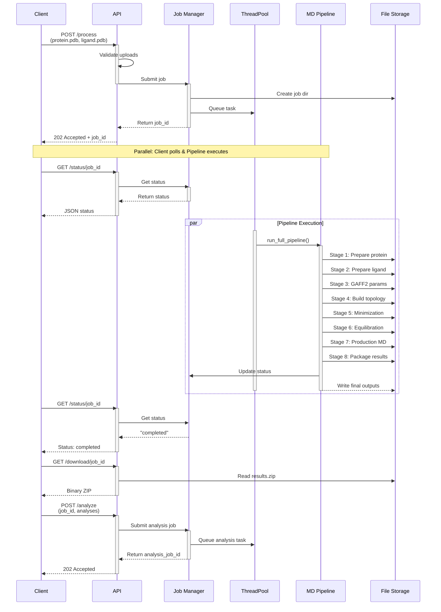

---

## 4. Data Directory Structure (Runtime)

```mermaid
graph TD
    ROOT["data/"]
    
    JOB1["job_abc123/"]
    JOB2["job_def456/"]
    
    IN1["inputs/"]
    WORK1["work/"]
    RES1["results/"]
    AN1["analysis/"]
    LOGS1["logs/"]
    
    INF["protein_raw.pdb<br/>ligand_raw.pdb"]
    
    WF["protein_fixed.pdb<br/>ligand_clean.mol2<br/>ligand.gaff2.mol2<br/>GAFF_LIGcheck.frcmod<br/>solvated.inpcrd<br/>solvated.prmtop<br/>...other working files"]
    
    RF["production.dcd<br/>production.nc<br/>energies.csv<br/>final.pdb<br/>manifest.json"]
    
    AF["rmsd.csv<br/>rmsd_plot.png<br/>rmsf.csv<br/>rmsf_plot.png<br/>pca_coords.csv<br/>pca_plot.png<br/>prolif_frame_0.pkl<br/>lie_results.csv"]
    
    LF["job_abc123.log"]
    
    ROOT --> JOB1
    ROOT --> JOB2
    ROOT --> "|... more jobs|"
    
    JOB1 --> IN1
    JOB1 --> WORK1
    JOB1 --> RES1
    JOB1 --> AN1
    JOB1 --> LOGS1
    
    IN1 --> INF
    WORK1 --> WF
    RES1 --> RF
    AN1 --> AF
    LOGS1 --> LF
    
    style ROOT fill:#fff9c4,stroke:#f57f17,stroke-width:2px
    style JOB1 fill:#e1f5fe,stroke:#01579b
    style IN1 fill:#c8e6c9,stroke:#2e7d32
    style WORK1 fill:#ffe0b2,stroke:#e65100
    style RES1 fill:#f8bbd0,stroke:#880e4f
    style AN1 fill:#e0f2f1,stroke:#00695c
    style LOGS1 fill:#fce4ec,stroke:#c2185b
```

---

## 5. Module Dependencies

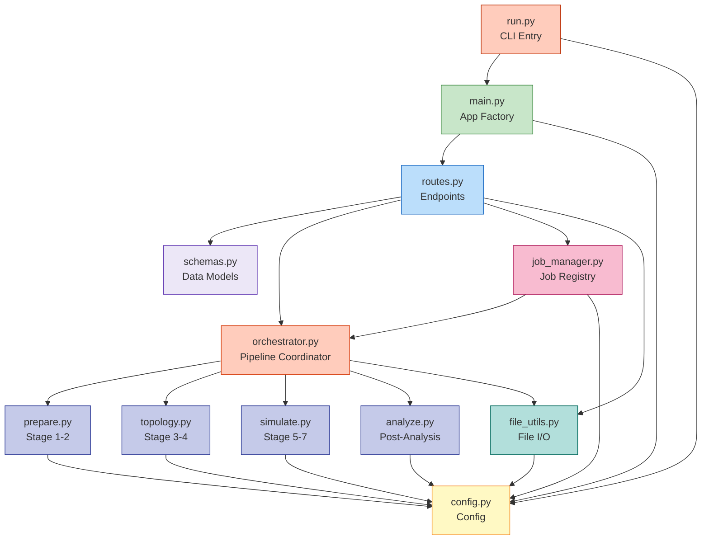

---

## 6. API Endpoint Map

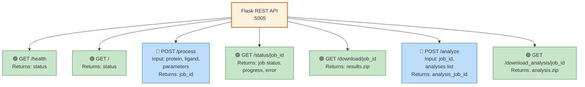

---

## 7. Job State Machine

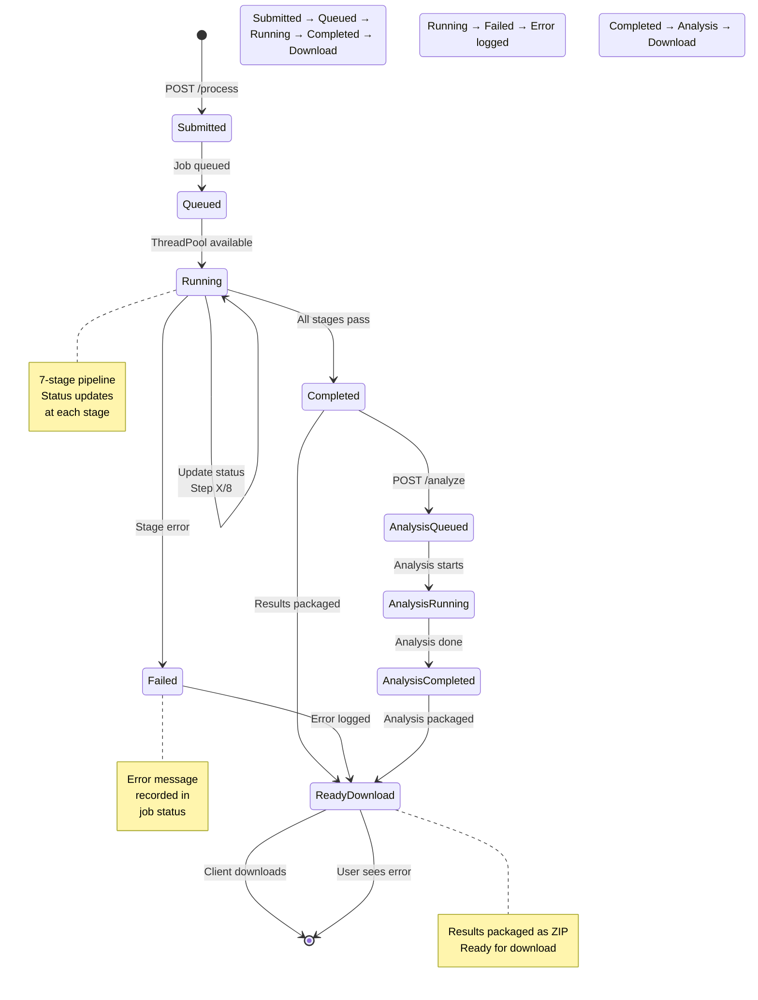

---

## 8. Technology Stack Pyramid

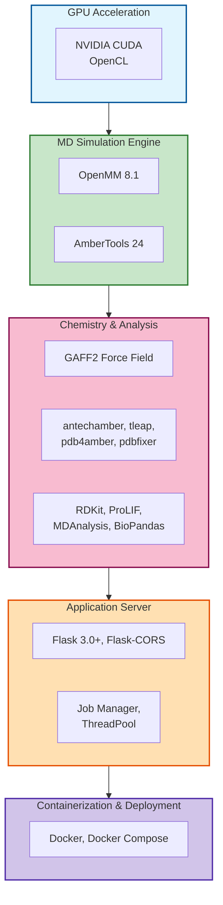

---

## 9. Solvation & Ion Setup

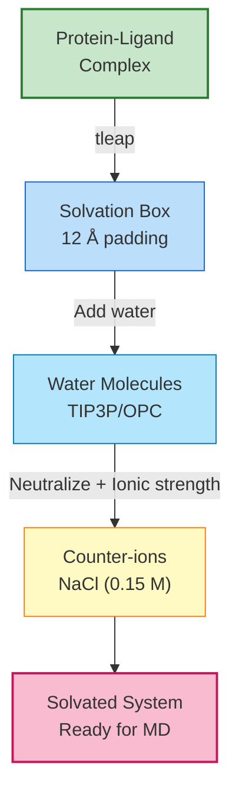

---

## 10. Equilibration Protocol

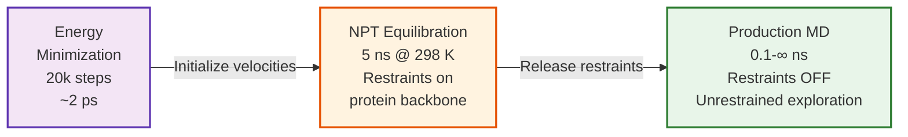

---

## 11. Analysis Module Outputs

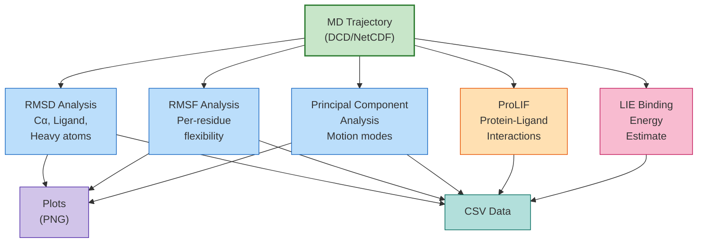

---

## 12. Error Handling Flow

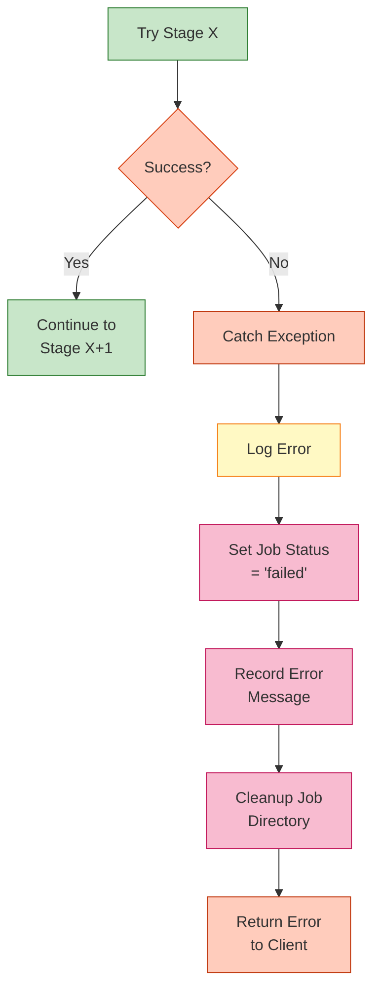

---

## Usage Diagram: Typical User Workflow

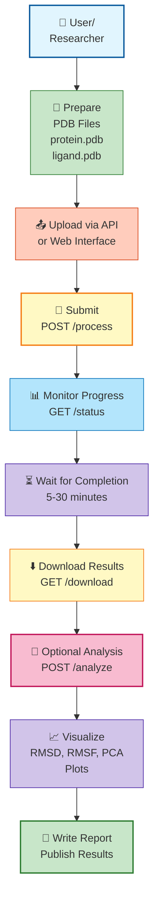

---

## Performance Comparison: CPU vs GPU

### Execution Time Profile

For a typical 0.1 ns production MD run:

```
CPU (4 cores):        ████████████████████████ 60 min
CPU (8 cores):        ████████████████ 40 min
GPU (RTX 3080):       ██ 2 min
GPU (A100):           █ 1 min
```

### Memory Profile

```
CPU simulation:       ██████ 8 GB
GPU simulation:       ████████████ 12 GB (GPU memory)
```

---

## Troubleshooting Decision Tree

```
ERROR FROM GET /status/<job_id>
│
├─ Status = "running"?
│  └─ EXPECTED: Wait and poll again
│
├─ Status = "completed"?
│  └─ Good! Make GET /download/<job_id>
│
├─ Status = "failed"?
│  └─ Check error message
│    ├─ "PDB parsing error"?
│    │  └─ FIX: Validate PDB format
│    ├─ "antechamber failed"?
│    │  └─ FIX: Check ligand structure
│    ├─ "tleap failed"?
│    │  └─ FIX: Verify GAFF2 parameters
│    ├─ "Simulation diverged"?
│    │  └─ FIX: Reduce timestep, increase minimization
│    └─ "Out of memory"?
│       └─ FIX: Reduce simulation time, use GPU
│
└─ Job not found (404)?
   └─ FIX: Check job_id spelling, retry POST /process
```

---

## End of Visual Documentation

For detailed explanations of each component, architecture decisions, and API usage, refer to [SYSTEM_ARCHITECTURE.md](SYSTEM_ARCHITECTURE.md).
